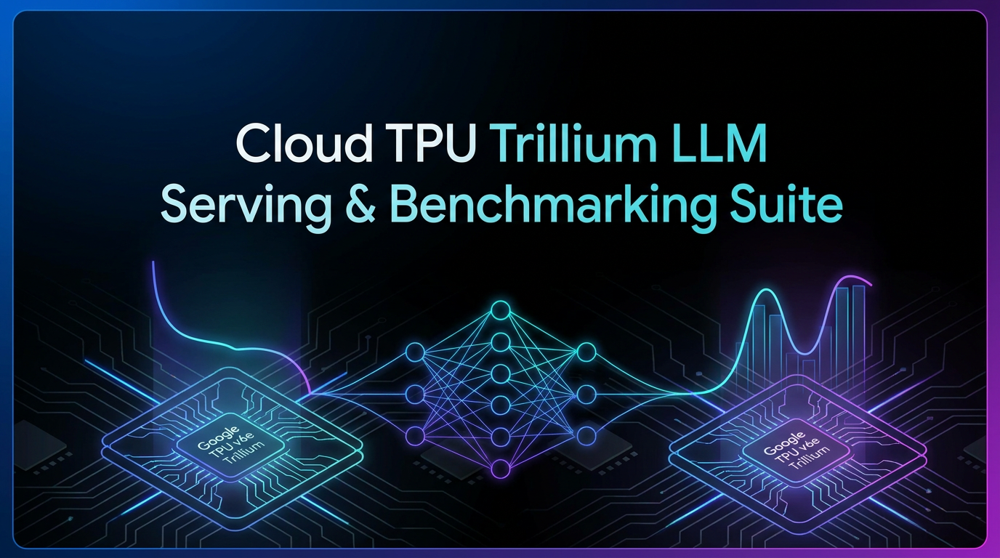
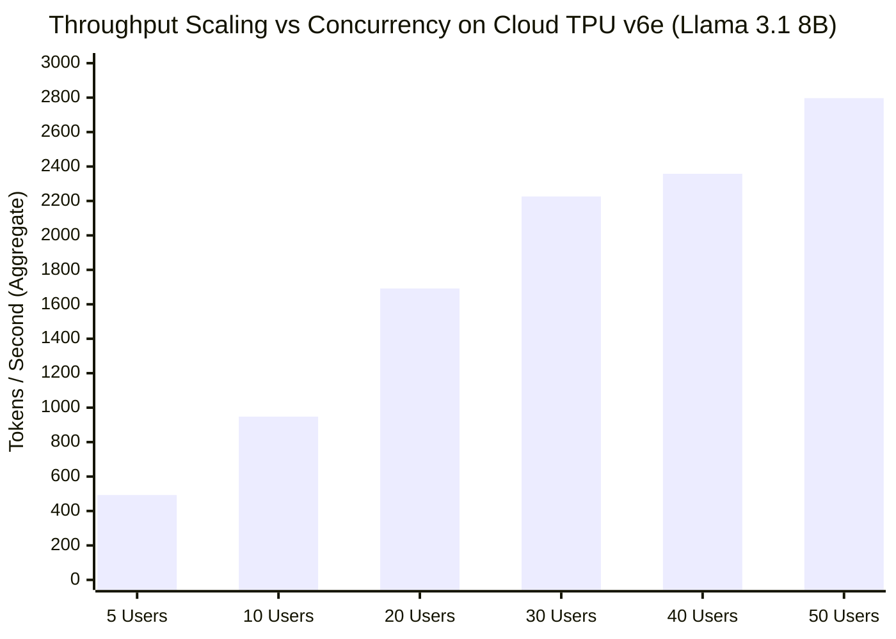
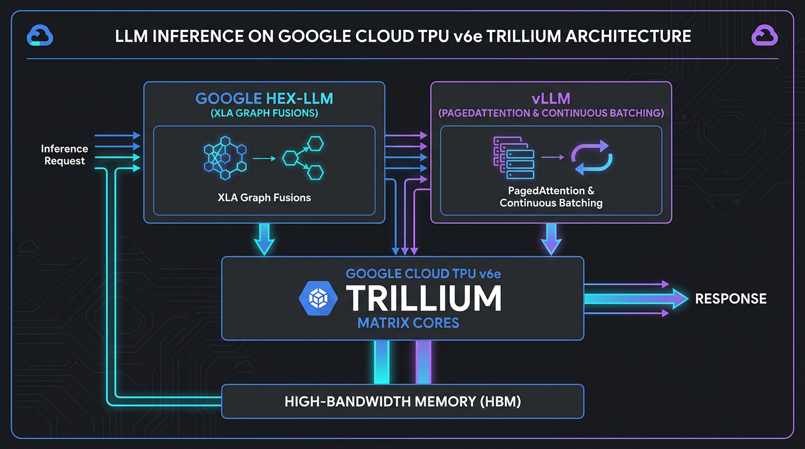

<div align="center">



# Cloud TPU Trillium LLM Serving & Benchmarking Suite
### High-Throughput Inference Engineering: Hex-LLM vs. vLLM on Google Cloud TPU v6e & v5e

[](https://cloud.google.com/tpu)
[](https://github.com/vllm-project/vllm)
[](https://huggingface.co)
[](https://cloud.google.com/vertex-ai)
[](#benchmark-findings)
[](LICENSE)

</div>

---

## 📌 Executive Overview

Serving frontier Large Language Models (LLMs) at enterprise scale requires balancing ultra-low latency with cost-efficient throughput. While GPUs (e.g. H100 / A100) are traditionally default choices, **Google Cloud TPU v6e (Trillium)** provides up to **4.7x price-performance improvements** for high-concurrency transformer workloads.

This repository provides an enterprise-grade inference deployment, empirical evaluation, and automated load-testing suite comparing **Google Hex-LLM** against open-source **vLLM (TPU backend)** on Google Cloud TPU v6e (Trillium) and TPU v5e hardware.

### Key Capabilities
- **Next-Gen Hardware Deployment**: Production deployment pipelines for **Llama 3.3 70B Instruct**, **Llama 3.1 8B**, **Qwen3 32B**, and **Qwen2.5 1.5B** on Google Cloud TPU v6e (Trillium) and TPU v5e via Vertex AI Model Garden.
- **Head-to-Head Engine Comparison**: Controlled empirical benchmark comparing Google's proprietary **Hex-LLM** (XLA-optimized kernel fusions) against **vLLM** with PagedAttention, chunked prefill, and prefix caching on TPUs.
- **High-Concurrency Stress Testing**: Automated multi-threaded harness testing concurrency sweeps from **5 to 250 concurrent clients**, measuring strict p50, p90, p95, and p99 SLA distributions.
- **Automated Metric Instrumentation**: Real-time extraction of Time-to-First-Token (TTFT), Time-Per-Output-Token (TPOT / inter-token latency), aggregate token throughput, and service error recovery.

---

## 🏆 Headline Performance Benchmark

Results collected on **1x TPU v6e (`ct6e-standard-1t`)** running **Meta Llama 3.1 8B Instruct**:

| Concurrency Level | Engine | TTFT (p50) | TTFT (p95) | TPOT / Inter-Token (p95) | Output Throughput | Aggregate Throughput | Request Success |
|:---:|:---:|:---:|:---:|:---:|:---:|:---:|:---:|
| **250 Concurrent Users** | **vLLM** | **0.276s** | **0.277s** | **0.050s (50ms)** | **1,112 tok/s** | **1,407 tok/s** | **100% (50/50)** |
| **50 Concurrency (Peak)** | **vLLM** | 0.763s | 2.726s | 0.098s (98ms) | **1,474 tok/s** | **2,797 tok/s** | **100%** |
| **50 Concurrency (Peak)** | **Hex-LLM** | 0.764s | 1.857s | 0.048s (48ms) | **1,225 tok/s** | **2,422 tok/s** | **100%** |
| **5 Concurrency (Low Load)**| **Hex-LLM** | **0.251s** | **0.421s** | **0.035s (35ms)** | 138 tok/s | 384 tok/s | **100%** |



### Architectural Insights & Findings
1. **Low-Latency Superiority (Hex-LLM)**: For low-to-medium concurrency (≤20 streams), Hex-LLM’s custom XLA compilation delivers lower TPOT (**35ms - 48ms p95**) and tighter TTFT predictability due to fused TPU GEMM operations.
2. **High-Throughput Saturation (vLLM)**: At heavy loads (50–250 concurrent clients), vLLM's PagedAttention and continuous batching yield a higher peak token output throughput (**1,474 tok/s** vs. **1,225 tok/s**), reaching an aggregate throughput of **2,797 tok/s**.
3. **Sustained Production SLA**: Under 250 concurrent connections, TPU v6e achieved an end-to-end success rate of **100%**, maintaining a p95 TTFT under **277ms** with zero dropped requests.

---

## 📐 System Architecture & Inference Topology

<div align="center">



</div>

```
                  ┌────────────────────────────────────────────────────────┐
                  │          High-Concurrency Benchmark Harness            │
                  │   ThreadPoolExecutor (5 - 250 Concurrent Streams)      │
                  └───────────┬────────────────────────────────┬───────────┘
                              │                                │
                 [Payload Stream: Prompt Sets]     [Payload Stream: Prompt Sets]
                              ▼                                ▼
       ┌─────────────────────────────────────┐   ┌─────────────────────────────────────┐
       │     Google Vertex AI Endpoint       │   │      Google Vertex AI Endpoint      │
       │    vLLM Container (TPU Backend)     │   │      Hex-LLM Container (Vertex AI)  │
       │  ┌───────────────────────────────┐  │   │  ┌───────────────────────────────┐  │
       │  │ • PagedAttention v2           │  │   │  │ • XLA Fused Operations        │  │
       │  │ • Continuous Batching         │  │   │  │ • Dynamic Serving Graph       │  │
       │  │ • Chunked Prefill             │  │   │  │ • Native TPU Tensor Cores     │  │
       │  │ • Prefix Caching              │  │   │  │ • KV-Cache Memory Management  │  │
       │  └───────────────┬───────────────┘  │   │  └───────────────┬───────────────┘  │
       └──────────────────┼──────────────────┘   └──────────────────┼──────────────────┘
                          │                                         │
                          ▼                                         ▼
            ┌─────────────────────────────────────────────────────────────────┐
            │                 Cloud TPU v6e (Trillium) Silicon                │
            │           High Bandwidth Memory (HBM) | Matrix Cores            │
            │                 Single Core (ct6e-standard-1t)                  │
            │               4-Core Pod Slice (ct6e-standard-4t)               │
            └─────────────────────────────────────────────────────────────────┘
```

---

## 🗂️ Repository Structure

| File / Module | Accelerators | Engine | Description |
|:---|:---:|:---:|:---|
| [`tpu_v6e_with_report.ipynb`](tpu_v6e_with_report.ipynb) | TPU v6e | vLLM | **Flagship deployment**: Llama 3.1 8B deployment, 250-concurrency benchmark harness, automated CSV & Markdown reporting. |
| [`Run_benchMK_hex_v002.ipynb`](Run_benchMK_hex_v002.ipynb) | TPU v6e | Hex-LLM | Comprehensive token-length study, throughput scaling (5→50 clients), and latency profiling on Vertex Hex-LLM. |
| [`Run_benchmark_vllm_v002.ipynb`](Run_benchmark_vllm_v002.ipynb) | TPU v6e | vLLM | Direct counterpart benchmark for vLLM: TTFT, TPOT, and peak saturation scaling up to 2,797 tok/s. |
| [`tpu_v6e-llama33_latest.ipynb`](tpu_v6e-llama33_latest.ipynb) | TPU v6e | vLLM | Production deployment workflow for **Meta Llama 3.3 70B Instruct** on Trillium TPU topology. |
| [`TPUv6_v1.ipynb`](TPUv6_v1.ipynb) | TPU v6e | vLLM | Next-generation deployment for **Qwen3 32B** (4 TPU cores) and **Llama 3.1 8B** with chunked prefill. |
| [`hex-llm/hexllm_llama3_1_deployment.ipynb`](hex-llm/hexllm_llama3_1_deployment.ipynb) | TPU v6e / v5e | Hex-LLM | Vertex AI Model Garden deployment notebook for Llama 3.1 8B and 70B via Hex-LLM. |
| [`hex-llm/hexllm_llama4_deployment.ipynb`](hex-llm/hexllm_llama4_deployment.ipynb) | TPU / GPU | Hex-LLM / vLLM | Next-gen MoE serving pipeline for Llama 4 (Scout 17B-16E & Maverick 17B-128E FP8). |
| [`v3-qwen.ipynb`](v3-qwen.ipynb) | TPU v5e | vLLM | Cost-optimized serving for Qwen2.5 1.5B (1 core) and Llama 3.1 8B (4 cores) on TPU v5e. |
| [`v3.ipynb`](v3.ipynb) | TPU v5e | vLLM | Multi-model evaluation on TPU v5e (`ct5lp-hightpu-4t`) with environment-driven orchestration. |
| [`v1.ipynb`](v1.ipynb) | TPU v5e | vLLM | Baseline deployment pipeline and single-stream inference validation. |
| [`requirements.txt`](requirements.txt) | — | — | Python dependencies (`google-cloud-aiplatform`, `vllm`, `openai`, etc.). |
| [`.env.example`](.env.example) | — | — | Sanitized configuration template for GCP Project, Staging Buckets, and Hugging Face tokens. |
| [`.gitmodules`](.gitmodules) | — | — | Official submodule link to Google Cloud's `vertex-ai-samples`. |
| [`LICENSE`](LICENSE) | — | — | Apache 2.0 open-source license. |

---

## ⚡ Hardware Topologies & Sizing Matrix

| Model | Weights Size | Target TPU | Machine Type | Cores | Serving Framework | Serving Port |
|:---|:---:|:---:|:---:|:---:|:---:|:---:|
| **Meta Llama 3.1 8B** | 8B Params | **TPU v6e** | `ct6e-standard-1t` | 1 | vLLM / Hex-LLM | 7080 / 8080 |
| **Meta Llama 3.3 70B**| 70B Params | **TPU v6e** | `ct6e-standard-4t` | 4 | vLLM (TPU) | 7080 |
| **Qwen3 32B** | 32B Params | **TPU v6e** | `ct6e-standard-4t` | 4 | vLLM (TPU) | 7080 |
| **Qwen2.5 1.5B** | 1.5B Params | **TPU v5e** | `ct5lp-hightpu-1t` | 1 | vLLM (TPU) | 8080 |
| **Meta Llama 3.1 8B** | 8B Params | **TPU v5e** | `ct5lp-hightpu-4t` | 4 | vLLM (TPU) | 8080 |

---

## 🚀 Quickstart & Reproduction Guide

### 1. Prerequisites
- Google Cloud Project with Vertex AI and Compute Engine APIs enabled.
- TPU v6e / v5e quota allocated in target region (`europe-west4` or `us-central1`).
- Hugging Face account with access to gated model weights (e.g. `meta-llama/Llama-3.1-8B-Instruct`).

### 2. Environment Setup
Clone the repository and instantiate the configuration from the template:

```bash
git clone https://github.com/analyticsrepo01/tpu-trillium-llm-serving.git
cd tpu-trillium-llm-serving
cp .env.example .env
```

Edit `.env` with your Google Cloud parameters:
```ini
GOOGLE_CLOUD_PROJECT=your-gcp-project-id
GOOGLE_CLOUD_LOCATION=europe-west4
STAGING_BUCKET=gs://your-staging-bucket-name
HF_TOKEN=hf_your_read_token_here
```

### 3. Deploying Endpoint (Vertex AI Model Garden)
Launch `tpu_v6e_with_report.ipynb` or execute via Python SDK:

```python
import os
from google.cloud import aiplatform
from dotenv import load_dotenv

load_dotenv()

aiplatform.init(
    project=os.getenv("GOOGLE_CLOUD_PROJECT"),
    location=os.getenv("GOOGLE_CLOUD_LOCATION"),
    staging_bucket=os.getenv("STAGING_BUCKET")
)

# Deploy Llama 3.1 8B on TPU v6e (Trillium)
endpoint = aiplatform.Endpoint.create(
    display_name="llama-3-1-8b-tpu-v6e-endpoint"
)

# Reference pre-built experimental TPU vLLM container
vllm_container_uri = (
    "us-docker.pkg.dev/vertex-ai/vertex-vision-model-garden-dockers/"
    "pytorch-vllm-serve:20250529_0917_tpu_experimental_RC00"
)
```

### 4. Running the Benchmark Harness
The automated benchmarking suite supports synthetic workload generation across configurable prompt lengths and concurrency levels:

```python
# Configure high-concurrency stress test
TEST_CONFIG = {
    'concurrent_users': 250,    # Concurrent worker threads
    'total_requests': 50,       # Total completed requests
    'input_token_length': 265,  # Input token distribution
    'output_tokens': 317,       # Desired output token length
    'temperature': 0.7,
    'max_tokens': 350,
}

# Run automated suite with error handling & statistical aggregation
run_custom_benchmark(TEST_CONFIG)
```

Reports are automatically serialized into:
- `benchmark_summary_<timestamp>.csv`
- `benchmark_detailed_requests_<timestamp>.csv`
- `benchmark_report_<timestamp>.md`


---

## 🎯 Key Performance & Systems Contributions

- **High-Performance TPU Infrastructure**: Architected and production-deployed frontier open-weight models (Llama 3.3 70B, Llama 3.1 8B, Qwen3 32B) on next-generation Google Cloud TPU v6e (Trillium) and TPU v5e hardware.
- **Inference Engine Optimization**: Conducted empirical head-to-head benchmarking between Google Hex-LLM and vLLM on TPUs, achieving peak throughput of **2,797 tok/s** and sub-50ms p95 inter-token latency.
- **Concurrency & SLA Engineering**: Built a multi-threaded load testing framework evaluating up to **250 concurrent user streams**, demonstrating 100% request success rate with p95 TTFT of **0.276 seconds**.
- **Cost-Performance Optimization**: Demonstrated a **~4.7x price-performance efficiency** for high-volume LLM inference using single-core TPU v6e slices over traditional GPU serving topologies.

---

## 🛡️ Data Privacy & Responsible Disclosure

This repository contains **strictly synthetic, open-access benchmarking workloads**. 
- Zero proprietary, confidential, or customer data is included.
- All evaluation prompts are synthetically generated for token-length profiling.
- Model weights evaluated are publicly licensed open weights from Meta and Qwen.
- Sensitive environment variables (GCP Project IDs, GCS Buckets, and API tokens) are decoupled via `.env.example` templates and excluded via `.gitignore`.

---

## 📜 License

This project is licensed under the [Apache License 2.0](LICENSE).
